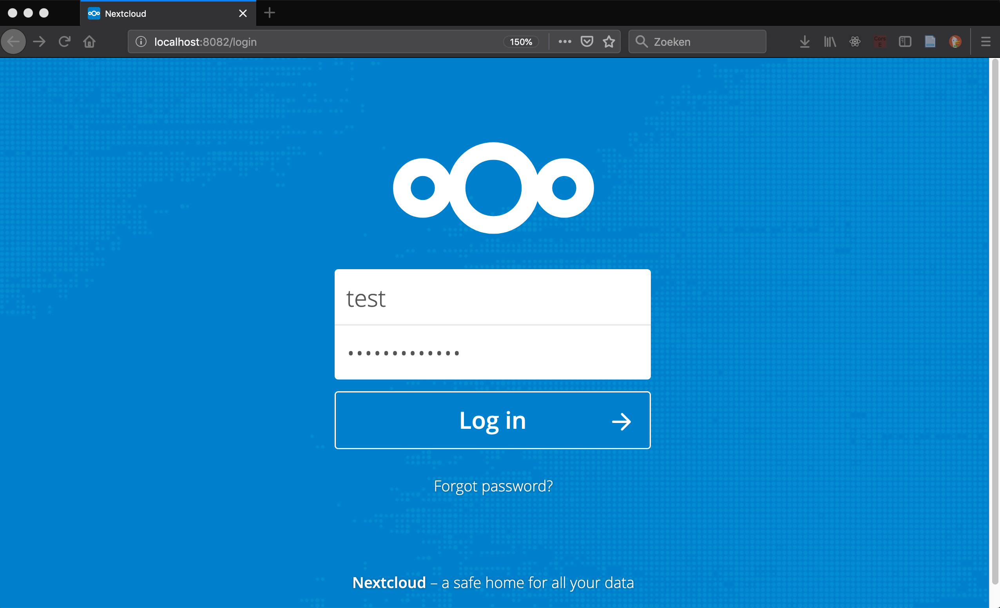
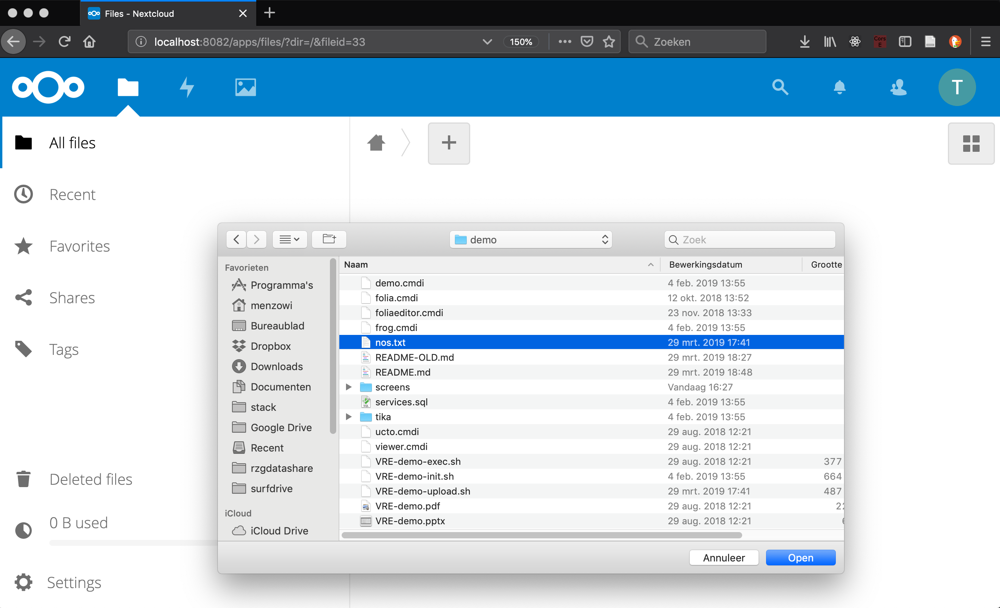
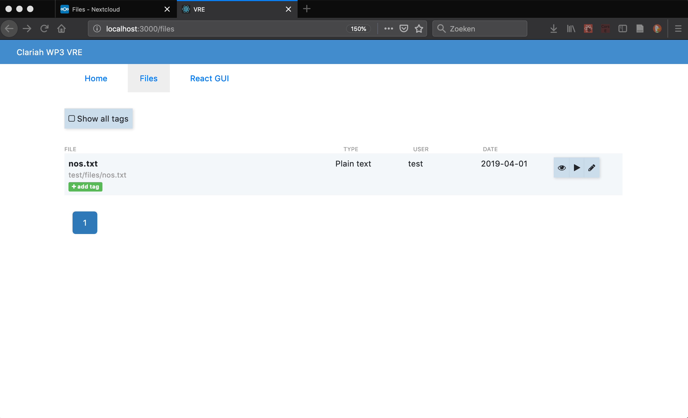
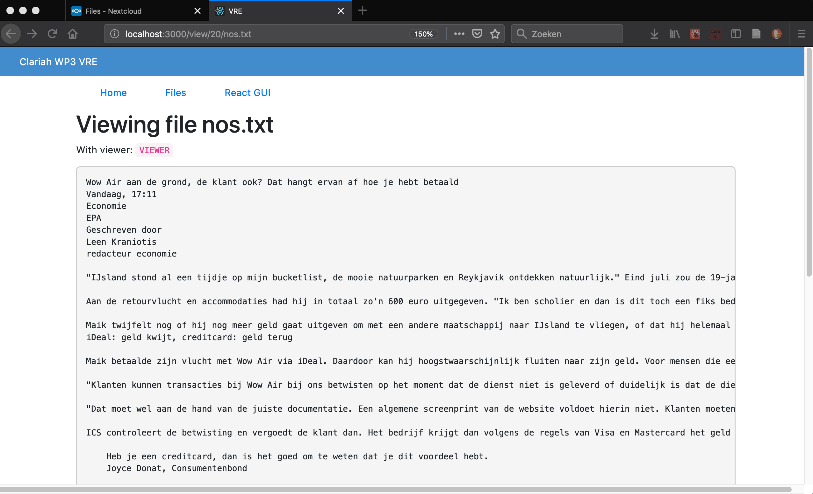
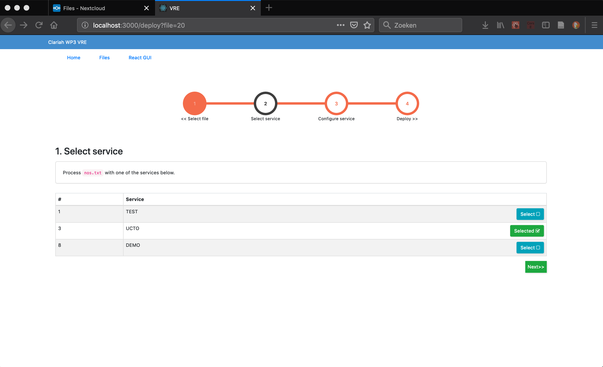
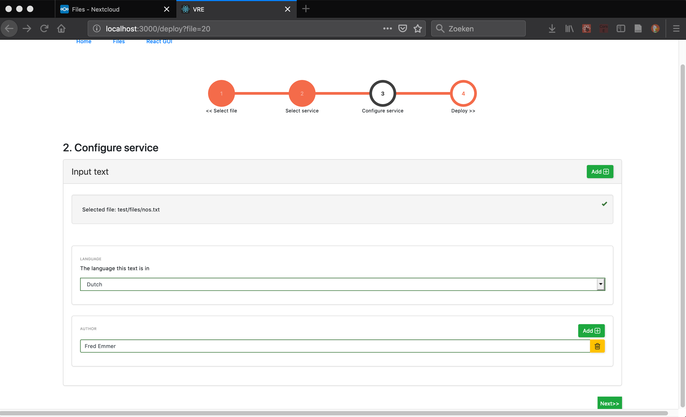
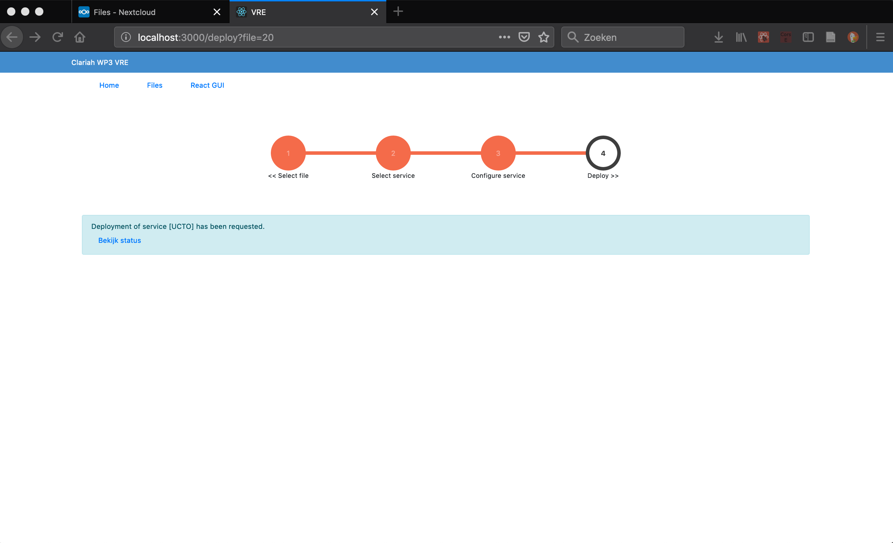

# CLARIAH - WP3 - VRE - demo

## Prepare the demo

0. Insert service recipes: 
   `./VRE-demo-init.sh`
1. Insert tika html recipe:
   `cd tika && ./tika.sh`

## Scenario in the frontend

1. Login into NextCloud
   - http://localhost:8082/
   - (login `test:achtkarakters`)

  

2. Upload a plain text file

  

3. Go to the VRE
   - http://localhost:3000/
   - switch to the Files tab

  

4. View the file

  

5. Execute UCTO on the file

  

  

  

6. View the FoLiA result

  **TODO**

## Scenario on the backend

1. Create a sample text file
  - create a fresh `nos.txt` with a news item from nos.nl

2. Upload the sample text file

```sh
./VRE-demo-upload.sh
```

At the end of the script the _id_ of the new file is printed. Remember it for the next step.

3. Execute UCTO for the sample text file

```sh
./VRE-demo-exec.sh <id>
```

Replace `<id>` by the _id_ assigned to the file during upload.

## Inspect the backend

1. Show the files in NextCloud

  - http://localhost:8082/
  - (login `test:achtkarakters`)
  
2. Show the messages in Kafka
  
  - goto http://localhost:9000/#/observe

3. Show the entries in the Object Registry

  - goto http://localhost:8089
  - login `noreply@dreamfactory.dev:password`
  - goto `Data > Objects VRE > Object`
  - click `Set Service`
  - enable all fields in the `Fields` tab

4. Show the entries in the Service Registry

  - goto http://localhost:8089
  - login `noreply@dreamfactory.dev:password`
  - goto `Data > Services VRE > Service`
  - click `Set Service`
  - enable all fields in the `Fields` tab

## Create your own recipe
Want to wrap your own service in a VRE recipe? See `./tika/README.md` for an example.
